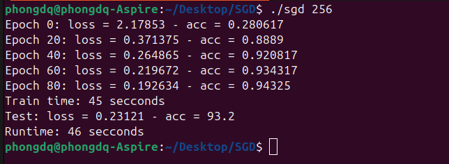
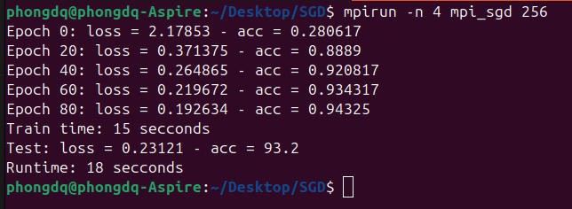

## Introduce
- Classification image use neuron network
- Dataset: MNIST
- Optimizer: mini-batch SGD (Single and Parallel)
- Data Parallel
- Architecture: Full connected (32 -> 64 -> 64 -> 32 -> 10)
- Library: Eigen (library supports matrix, vector)
- Env: Linux/Ubuntu

## Requirement
- OpenMPI
- C++
- Extract eigen.zip, MNIST_CSV.zip
## Compile
### Single Algo
```
g++ -I eigen -O3 sgd.cpp -o result/sgd
```
### Parallel Algo
```
mpic++ -I eigen -O3 mpi_sgd.cpp -o result/mpi_sgd
```
## Run
### Single Program (batch size = 256)
```
./result/sgd 256
```
### Parallel Program (batch size = 256)
```
mpirun -n 3 result/mpi_sgd 256
```
## Result
### Average runtime over 20 runs

| Batch size | Single   | 2 cores   | 3 cores   | 4 core    |
|------------|----------|-----------|-----------|-----------|
| 64         | 48.37s   |35.77s     |33.71s     | 29.88s    |
| 128        | 48.37s   |32.48s     |28.55s     | 24.51s    |
| 256        | 48.37s   |26s        |21.94s     | 20.38s    |
-------------------------------------------------------------

### Examples





